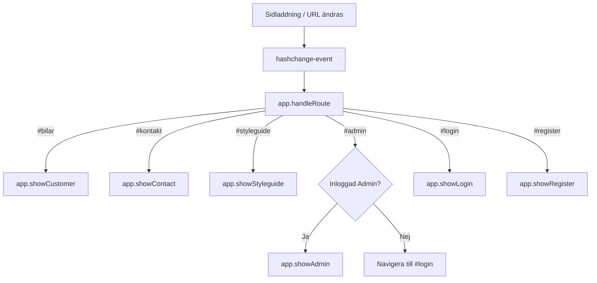
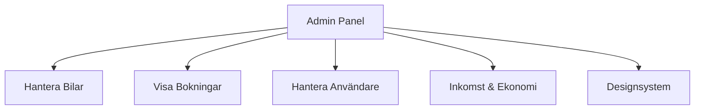

# Teknisk Manual för `script.js`

Detta dokument beskriver arkitekturen, funktionerna, API-integrationerna och tillståndshanteringen i frontend-applikationens centrala JavaScript-fil: `script.js`.

---

## 1. Översikt & Arkitektur

Applikationen är uppbyggd som en **SPA (Single-Page Application)** utan externa ramverk (Vanilla JS). All funktionalitet är inkapslad i det globala objektet `app`. 

För att underlätta underhåll och navigering i den stora källkodsfilen börjar `script.js` med en strukturerad **innehållsförteckning (INDEX)** som listar alla tillgängliga metoder grupperade efter ansvarsområde. Genom att söka efter ett specifikt funktionsnamn (t.ex. `app.showReturnModal(bookingId)`) går det snabbt att hoppa direkt till definitionen.

När webbsidan har laddats (`DOMContentLoaded`) körs initieringsmetoden:
```javascript
document.addEventListener('DOMContentLoaded', () => app.init());
```
`app.init()` laddar automatiskt kundvyn (`showCustomer`) som standardsida.

---

## 2. Globalt Tillstånd (State Management)

Objektet `app` sparar applikationens nuvarande tillstånd i följande variabler på rot-nivå:

| Variabel | Typ | Beskrivning |
| :--- | :--- | :--- |
| `baseUrl` | `String` | Bas-URL till backend API (`http://localhost:8080/api/v1`). |
| `user` | `Object` / `null` | Sparar information om den inloggade användaren (`id`, `username`, `role`). |
| `auth` | `String` / `null` | Base64-kodad sträng med inloggningsuppgifter (`username:password`) för HTTP Basic Auth. |
| `cars` | `Array` | Cachelagrad lista över hämtade bilar från backend. |
| `bookings` | `Array` | Cachelagrad lista över hämtade bokningar (endast i adminläge). |
| `users` | `Array` | Cachelagrad lista över registrerade användare (endast i adminläge). |
| `carSort` | `Object` | Sorteringsinställning för bilar (t.ex. `{ field: 'name', asc: true }`). |
| `carFilterType`| `String` | Aktivt bil-typfilter (t.ex. `'all'`, `'Cab'`, `'Sport'`). |
| `adminSort` | `Object` | Aktiv sorteringsinställning för tabeller i adminpanelen. |
| `currentAdminType` | `String` / `null` | Aktiv tabellkategori i adminpanelen (`'cars'`, `'bookings'`, `'users'`). |
| `currentReturnData` | `Object` / `null` | Håller tillfällig beräkningsdata och detaljer för den bokning som returneras (inkl. kund- och biluppgifter, priser samt straffavgifter). |

---

## 3. API-klient & Autentisering

### API-anrop via `app.api()`
En centraliserad wrapper runt `fetch` som hanterar HTTP-kommunikation, headers, JSON-serialisering och felhantering.

* **Basic Auth**: Om `this.auth` är satt bifogas automatiskt en `Authorization: Basic [credentials]`-header till alla anrop.
* **FormData & Bilduppladdning**: Om `body` är en instans av `FormData` (används vid bilskapande/uppdatering med bilder) skickas den direkt utan `Content-Type: application/json`, vilket tillåter webbläsaren att generera multipart boundary-värden.
* **Felhantering**: Fångar statuskod `401` (Unauthorized) och allmänna serverfel (`!response.ok`), samt returnerar JSON-data eller `null` om svaret är tomt.

### Autentiseringsmetoder
* `setAuth(username, password)`: Skapar Base64-strängen för Basic Auth och skapar ett lokalt `user`-objekt.
* `updateNavbar()`: Uppdaterar navigeringsfältet dynamiskt. Visar/döljer länkar (t.ex. "Admin Kontrollpanel") och visar användarnamnet om användaren är inloggad.
* `logout()`: Nollställer inloggningssessionen, uppdaterar navigeringsfältet och navigerar programmatiskt till `#bilar`.

---

## 4. UI-rendering och Flöden (Routing)

Applikationen är en fullfjädrad SPA (Single Page Application) som använder hashbaserad routing (`window.location.hash`) för att hantera vyer och tillåta bokmärken eller direktlänkar (t.ex. `#kontakt` eller `#bilar`).



### Navigering och routingmekanismer
* `init()`: Registrerar en lyssnare på `hashchange`-eventet och läser av den tillgängliga hashen på sidan vid start. Saknas hash sätts den automatiskt till `#bilar`.
* `handleRoute()`: Den centrala routern som läser av `window.location.hash` och anropar motsvarande renderingsmetod. Den ser även till att uppdatera den aktiva länken i navigationsmenyn med klassen `.active`.
* `navigate(hash)`: Används för programmatisk navigering. Om hashen redan matchar den önskade hashen, tvingas en routing-uppdatering via `handleRoute()` direkt (t.ex. vid återkommande inloggningar på samma vy), annars ändras `window.location.hash` vilket triggar det globala `hashchange`-eventet automatiskt.

### Kundvy & Bokning
* `showCustomer()`: Hämtar bilar från `/cars`, bygger en Hero-layout via `renderLayout()` och anropar därefter `renderCars()`.
* `renderCars()`:
  * Läser ut unika biltyper dynamiskt ur bildatan för att fylla filtreringslistan.
  * Filtrerar bilarna på vald typ och sorterar dem (A-Ö, Ö-A, etc.) enligt användarens val.
  * Renderar responsiva kort för varje bil med bilder, egenskaper och priser.
* `showBookingForm(carId)`: Renderar en bokningsvy för ett valt fordon. Om användaren inte är inloggad styrs de om till inloggningsskärmen.
* `handleBooking(e, carId)`: Skickar en POST-förfrågan till `/bookings` med start- och slutdatum. Om användaren är inloggad som administratör visas ett felmeddelande som förklarar att endast konton med rollen `ROLE_USER` (kunder) har tillåtelse att boka bilar.

### Kontaktformulär & Modaler
* `showContact()`: Visar kontaktinformation.
* `showContactModal()`: Öppnar en meddelande-modal (`#modal-backdrop`).
* `closeModal()`: Stänger modalen med en mjuk CSS-övergång.

### Personlig Profilvy (Min Profil)
* `showProfile()`: Hämtar användarens fullständiga data (inklusive `noOfOrders`) via `GET /users/{id}` och öppnar en redigeringsmodal. Användarnamn, roll och antal bokningar är skrivskyddade av säkerhetsskäl.
* `handleProfileSubmit(event)`: Skickar uppdaterade profilfält (Förnamn, Efternamn, E-post, Telefon och eventuellt lösenord) till backend via `PUT /users/{id}`. Om användaren ändrar sitt lösenord genereras en ny `Authorization` header-sträng (`this.auth`) för att bibehålla inloggningen.

---

## 5. Administrationspanel (Admin Kontrollpanel)

Administratörsfunktioner nås via `/admin` eller navigeringslänken och kräver inloggningsuppgifter med rollen `ADMIN`.



### Gemensam funktionalitet
* `loadAdminData(type)`: Generiskt anrop till `/cars`, `/bookings` eller `/users` beroende på vald flik, cachelagrar datan, markerar vald knapp som aktiv och anropar `renderAdminTable()`.
* `showAdminRevenue()`: Hämtar live-data från API:et för bokningar, bilar och kunder. Slår samman detta med lokala kvitton sparade i `localStorage` (`wigell_returns`) för att få korrekta betalningsmetoder, faktiska priser och returdatum. Presenterar sammanställningar över omsättning, grundhyror och förseningsavgifter samt renderar en komplett transaktionshistorik.
* `exportRevenueJSON()`: Genererar en nedladdningsbar JSON-fil med den fullständiga transaktionsloggen över alla slutförda uthyrningar för bokföring och revision.
* `setAdminSort(field)` & `sortData(data)`: Sorterar kolumner i admin-tabellerna stigande eller fallande baserat på vilken kolumnrubrik användaren klickar (eller tabbar och trycker Enter) på.
* `deleteItem(type, id)`: Visar en bekräftelse-ruta och skickar därefter ett `DELETE`-anrop för vald resurs till API:et.

### Datahantering (CRUD)

#### 📦 Bilar (`cars`)
* **Hämta**: Visas i en tabell med Märke, Modell, Pris och Typ.
* **Skapa**: `showAddCarForm()` och `handleAddCar(event)` skickar `FormData` (inklusive bilfiler) som `POST` till `/cars`.
* **Redigera**: `showEditCarForm(id)` laddar in existerande värden i formuläret. `handleEditCar(event, id)` skickar en `PUT`-förfrågan till `/cars/{id}` med den nya datan.

#### 📅 Bokningar (`bookings`)
* **Hämta**: Visar boknings-ID, Bil-ID, tidsperiod och en status-bricka (Aktiv/Slutförd).
* **Avboka**: Utförs genom att radera bokningen (`DELETE /bookings/{id}`).

#### 👥 Användare (`users`)
* **Hämta**: Visar användar-ID, Användarnamn och Roll (`ROLE_USER` / `ROLE_ADMIN`).
* **Skapa / Redigera**: `showUserModal(userId)` öppnar en modal med fält för Förnamn, Efternamn, Användarnamn, E-post, Telefon, Lösenord och Roll.
* **Skicka in**: `handleUserSubmit(event, userId)` skickar `POST` till `/users` (för nya användare) eller `PUT` till `/users/{userId}` (för ändringar). Om lösenordsfältet lämnas tomt vid redigering exkluderas det från förfrågan för att behålla användarens befintliga lösenord.

---

---

## 6. Återlämnings- & Betalningsflöde (Return Flow)

När en aktiv bokning ska stängas initieras återlämningsflödet via modalen `#modal-backdrop`. Detta kan utföras av kunden själv via deras profilmodal ("Returnera bil") eller av en administratör från bokningstabellen ("Returnera").

### Flödesbeskrivning och beräkningar
1. **Initiering (`showReturnModal`)**:
   * Hämtar aktuell bokning och fordonsdetaljer via API:et.
   * Hämtar kunduppgifter. Om kunden inte existerar (404-fel i testdata pga. föräldralösa rader) används en try-catch fallback med standardvärden (`{ firstName: 'Okänd', lastName: 'Kund', ... }`) för att förhindra krascher.
   * Beräknar antal bokade dygn (minst 1 dygn).
   * Beräknar eventuella förseningsdagar genom att jämföra dagens datum med bokningens slutdatum (`toDate`). Om återlämningen sker efter slutdatumet påförs en **straffavgift på 5% per försenat dygn** på grundhyran.
   * Sparar resultatet i `currentReturnData` och visar steg 1.
2. **Steg 1: Sammanfattning & Betalval (`renderReturnStep1`)**:
   * Visar en översikt av bokningen, perioden, kunden samt en prisredovisning (Grundhyra, Straffavgift och Totalpris).
   * Användaren väljer betalningsmetod via tre alternativ:
     * 💵 **Kontant (`renderReturnCash`)**: Visar ett textfält för att mata in betald summa. En funktion (`calculateCashChange`) beräknar växel i realtid. Knappen "Avsluta" aktiveras först när tillräckligt med kontanter matats in.
     * 💳 **Kort (`renderReturnCard`)**: Simulerar en blippning mot en kortterminal. Efter en kort fördröjning (`simulateCardTap`) visas en godkänd status med transaktionsreferens och knappen "Avsluta" aktiveras.
     * 📄 **Faktura (`renderReturnInvoice`)**: Genererar en detaljerad fakturavy med ett unikt fakturanummer (`FA-YYYYMMDD-[bookingId]`), kunduppgifter, moms (25% av beloppet), samt en fungerande utskriftsknapp kopplad till `window.print()`.
3. **Slutförande (`completeReturn`)**:
   * Skickar en `PUT`-begäran till `/bookings/return/{bookingId}` för att registrera återlämningen i backend (vilket sätter `active = false`).
   * Stänger modalen och laddar om den relevanta sidan (profilvyn eller admin-dashboarden).

---

## 7. Tillgänglighetsanpassning (WCAG 2.1/2.2)

Funktionerna i `script.js` är utformade för att följa WCAG-krav:
1. **Tangentbordsfokus**: Tabellhuvuden (`<th>`) har tilldelats `tabindex="0"` och lyssnar på `onkeydown` (Enter) för att tangentbordsanvändare ska kunna sortera listor utan mus.
2. **Kopplade ledtexter (Labels)**: Alla dynamiskt renderade formulär i filen använder explicita `for`- och `id`-attribut på etiketter och inmatningsfält vilket ger fullt stöd för skärmläsare.
3. **Modal Focus Trap**: När modalen stängs eller öppnas sköts detta i bakgrunden utan att bryta applikationens DOM-flöde.
